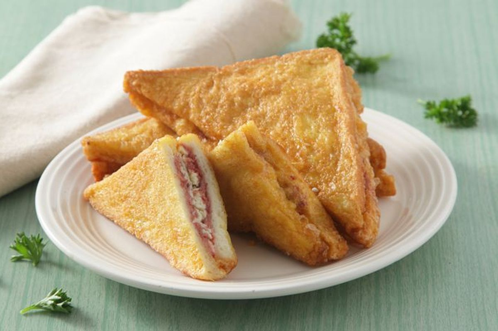
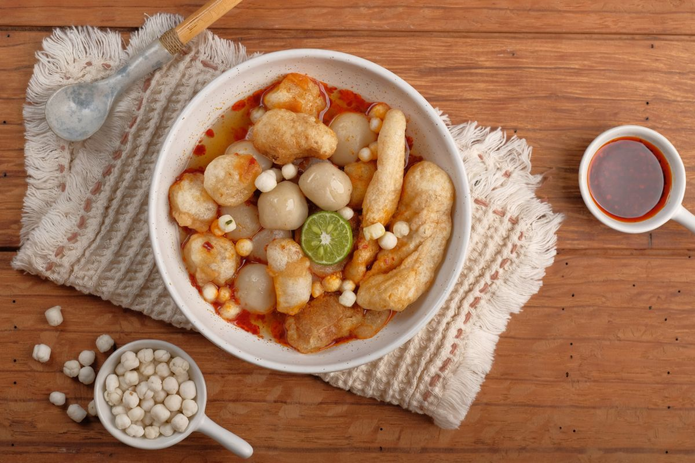
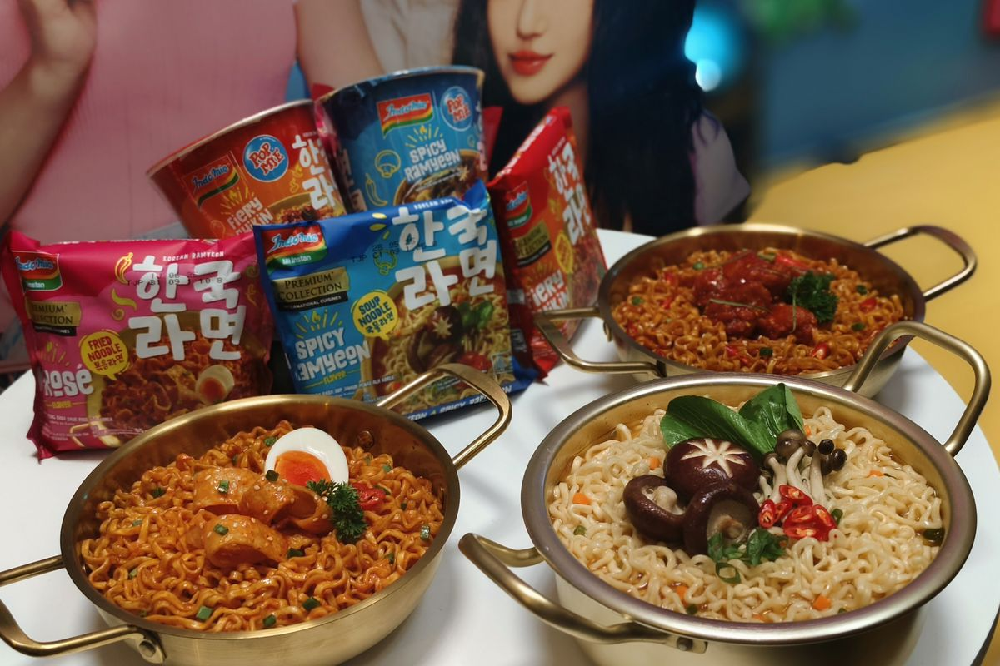
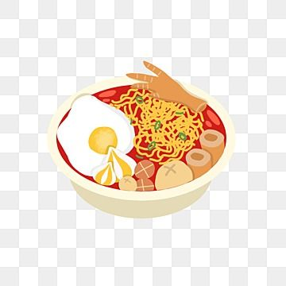

<html lang="id">
<head>
    <meta charset="UTF-8">
    <meta name="viewport" content="width=device-width, initial-scale=1.0">
    <title>WARUNG KENZ</title>
    <link rel="stylesheet" href="styles.css">
    <link href="https://fonts.googleapis.com/css2?family=Poppins:wght@300;400;700&display=swap" rel="stylesheet">
    
</head>
<body>
    <header>
        <h1>WARUNG KENZ</h1>
    </header>
    <nav>
        <a href="menu-makanan.html">Makanan</a>
        <a href="menu-minuman.html">Minuman</a>
        <a href="#order">Pesan</a>
    </nav>
    <section class="home-gallery">
        
        
        
        
        
        
        
        
        
    </section>
    <section class="order-form" id="order">
        <h2>Pesan Sekarang</h2>
        <a href="https://wa.me/6285777821020" class="order-button">Pesan via WhatsApp</a>
    </section>
    <footer>
        
&copy; 2025 WARUNG KENZ. Semua Hak Dilindungi.

    </footer>
</body>
</html>
